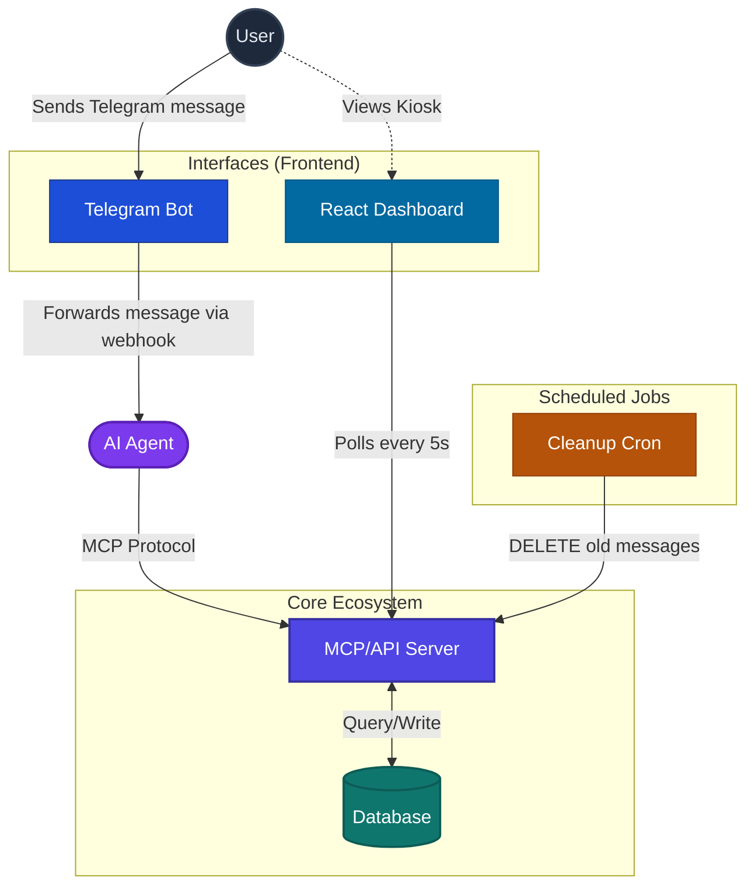

# TaskNexus API
### A Multi-Interface Productivity Engine

The headless task management backend that powers both an AI agent interface (via MCP) and a real-time kiosk dashboard. One server, two very different consumers — and zero manual scheduling.

---

## Why This Exists

When working on a project, I'd often want to break it down into tasks. But as someone who likes writing everything down, I found it genuinely tedious to manually create every task, set priorities, and schedule due dates myself. That got me thinking — what if I could just *describe* the project to my AI assistant and have it figure out the breakdown, create the tasks, and schedule everything for me?

To make that possible, I needed to expose the server over MCP so my AI agent could interact with it directly. But I also wanted to *see* my task list — not just use it from a chat interface. So I built a dashboard that lives on a monitor at my desk, always visible, always in sync. The result is a single API that both a Telegram bot agent and a wall-mounted kiosk pull from.

---

## Part of the TaskNexus Project

This repo is the core backend. The full project spans three repositories:

| Repo | Role |
|---|---|
| **TaskNexus Core** *(this repo)* | MCP server + REST API + database layer |
| [**TaskNexus Bot**](https://github.com/sepehrtabaee/task-nexus-bot) | AI agent + Telegram webhook handler |
| [**TaskNexus Dash**](https://github.com/sepehrtabaee/task-nexus-dash) | Kiosk dashboard |

---

## System Architecture



---

## Tech Stack

| Layer | Technology |
|---|---|
| Runtime | Node.js |
| Framework | Express |
| Database | PostgreSQL via Supabase |
| MCP SDK | `@modelcontextprotocol/sdk` |
| Schema validation | Zod |
| Deployment | Vercel (serverless) |

---

## MCP Tools

The server exposes the following tools to AI agents over the MCP protocol at `POST /mcp`. Any MCP-compatible agent (Claude, etc.) can call these directly.

### Lists

| Tool | Description | Required Inputs |
|---|---|---|
| `create_list` | Create a new task list for a user | `user_id`, `name` |
| `get_lists` | Get all lists belonging to a user | `user_id` |
| `update_list` | Rename a list | `list_id`, `name` |
| `delete_list` | Delete a list and all its tasks | `list_id` |

### Tasks

| Tool | Description | Required Inputs | Optional Inputs |
|---|---|---|---|
| `create_task` | Add a new task to a list | `list_id`, `title` | `description`, `due_date` (ISO 8601), `priority` (1–5) |
| `get_tasks` | Retrieve tasks in a list | `list_id` | `status` (`"all"` / `"completed"` / `"pending"`) |
| `get_tasks_by_user` | Retrieve tasks across all lists for a user | `user_id` | `status` (`"all"` / `"completed"` / `"pending"`) |
| `update_task` | Update any field on a task, including marking complete | `task_id` | `title`, `description`, `due_date`, `priority`, `is_completed` |
| `delete_task` | Delete a task | `task_id` | — |

The MCP transport runs in **stateless mode** — each request is self-contained, which is required for Vercel serverless deployment.

Full MCP tool reference is in [docs/MCP.md](docs/MCP.md).

---

## REST API

Full REST documentation is in [docs/API.md](docs/API.md). Summary of available route groups:

- `GET|POST|PUT|DELETE /api/users` — user management
- `GET|POST|PUT|DELETE /api/lists` — list management
- `GET|POST|PUT|DELETE /api/tasks` — task management (filter by `status=all|completed|pending`; `GET /api/tasks/user/:user_id` for cross-list queries)
- `GET|POST|DELETE /api/tags` — task tagging
- `/api/messages` — message log
- `/api/cron` — scheduled cleanup trigger
- `GET /health` — health check

---

## Database Setup

Run the following SQL in your [Supabase](https://supabase.com) project (SQL Editor) in order.

### Tables

```sql
CREATE TABLE taskmanager_users (
  id          UUID        PRIMARY KEY DEFAULT gen_random_uuid(),
  telegram_id BIGINT      UNIQUE NOT NULL,
  username    TEXT,
  first_name  TEXT,
  last_name   TEXT,
  created_at  TIMESTAMP   DEFAULT NOW()
);

CREATE TABLE taskmanager_lists (
  id         UUID      PRIMARY KEY,
  user_id    UUID      REFERENCES taskmanager_users(id),
  name       TEXT      NOT NULL,
  created_at TIMESTAMP DEFAULT NOW()
);

CREATE TABLE taskmanager_tasks (
  id           UUID      PRIMARY KEY,
  list_id      UUID      REFERENCES taskmanager_lists(id) ON DELETE CASCADE,
  title        TEXT      NOT NULL,
  description  TEXT,
  is_completed BOOLEAN   DEFAULT FALSE,
  due_date     TIMESTAMP,
  priority     INTEGER,
  created_at   TIMESTAMP DEFAULT NOW()
);

CREATE TABLE taskmanager_task_tags (
  task_id UUID REFERENCES taskmanager_tasks(id) ON DELETE CASCADE,
  tag_id  UUID REFERENCES taskmanager_tasks(id) ON DELETE CASCADE,
  PRIMARY KEY (task_id, tag_id)
);

CREATE TABLE taskmanager_messages (
  id         UUID        PRIMARY KEY DEFAULT gen_random_uuid(),
  user_id    UUID        NOT NULL REFERENCES taskmanager_users(id) ON DELETE CASCADE,
  role       TEXT        NOT NULL CHECK (role IN ('user', 'assistant')),
  content    TEXT        NOT NULL,
  created_at TIMESTAMPTZ NOT NULL DEFAULT NOW()
);

CREATE INDEX idx_taskmanager_messages_user_created
  ON taskmanager_messages (user_id, created_at DESC);
```

### Cleanup Function

Used by the cron job to keep only the 10 most recent messages per user:

```sql
CREATE OR REPLACE FUNCTION cleanup_old_messages()
RETURNS void AS $$
BEGIN
  WITH ranked_messages AS (
    SELECT
      id,
      ROW_NUMBER() OVER (
        PARTITION BY user_id
        ORDER BY created_at DESC
      ) AS rn
    FROM taskmanager_messages
  ),
  old_messages AS (
    SELECT id FROM ranked_messages WHERE rn > 10
  )
  DELETE FROM taskmanager_messages tm
  USING old_messages om
  WHERE tm.id = om.id;
END;
$$ LANGUAGE plpgsql;
```

### Server Setup

```bash
# 1. Install dependencies
npm install

# 2. Create .env in the project root
SUPABASE_URL=your_supabase_project_url
SUPABASE_ANON_KEY=your_supabase_anon_key
CRON_SECRET=your_cron_secret
PORT=3000

# 3. Start the server
npm start        # production
npm run dev      # development with auto-reload
```

The API will be available at `http://localhost:3000`.

---

## Related Repositories

- [**TaskNexus Bot**](https://github.com/sepehrtabaee/task-nexus-bot) — Telegram bot + AI agent that talks to this server over MCP
- [**TaskNexus Dash**](https://github.com/sepehrtabaee/task-nexus-dash) — React kiosk dashboard that polls this API
